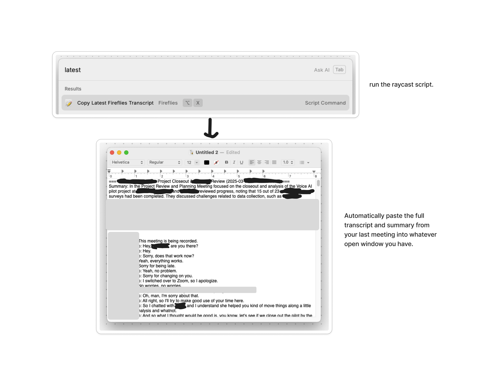
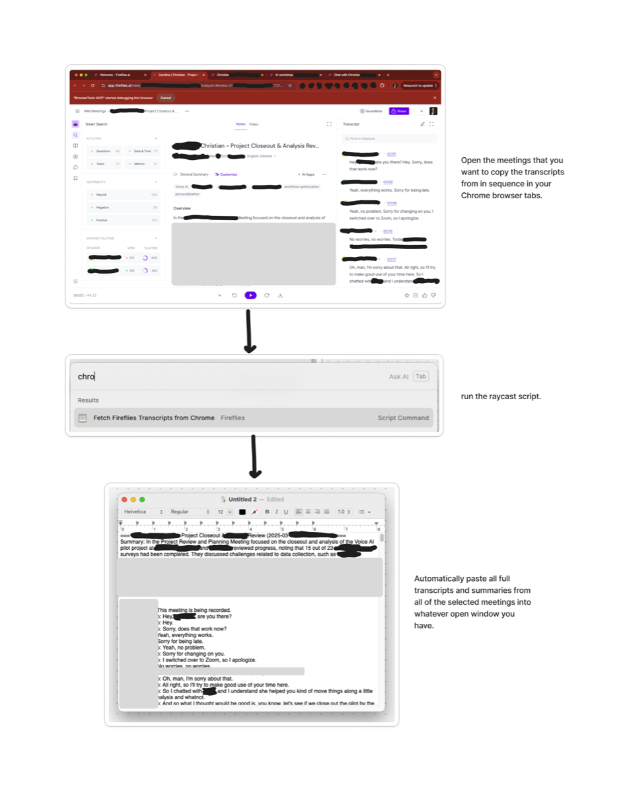

# FlyCast

<div align="center">

[](LICENSE)
[](https://github.com/culstrup/fireflies-raycast/stargazers)
[](https://ko-fi.com/culstrup)

</div>

Access your [Fireflies.ai](https://fireflies.ai) meeting transcripts directly from [Raycast](https://raycast.com)! This script collection allows you to:

1. **Copy your latest transcript** to your clipboard with a single command
2. **Fetch transcripts from open Chrome tabs** and copy them to your clipboard

Perfect for quickly referencing meeting notes, summaries, and transcripts while working.

## 🤔 Why FlyCast?

Context is king when working with AI. Meeting transcripts contain some of the most valuable context for your work, but they're often trapped in siloed systems, making it hard to leverage this data.

FlyCast solves this problem by making it effortless to:

- Extract transcript data from Fireflies (one of the few providers with an accessible API)
- Instantly use meeting transcripts with powerful AI tools like Claude, ChatGPT, and others
- Dramatically reduce friction when providing meeting context to AI systems

**Common Use Cases:**
- Provide user feedback from meetings to improve products
- Draft comprehensive follow-up emails after important discussions
- Get AI coaching and feedback on sales calls or negotiations
- Turn complex discussions into bespoke proposals
- Combine transcripts from multiple meetings on the same project for complete context

## 📸 Screenshots

**Copy Latest Transcript:**  


**Fetch All Transcripts from Chrome Tabs:**  


## 🚀 Quick Setup

1. Download or clone this repository
2. Run the setup script:
   ```bash
   ./setup.sh
   ```
3. Enter your Fireflies API key when prompted (or add it to the `.env` file later)
4. Add the script directory to Raycast

## 📋 How to Get Your Fireflies API Key

1. Log in to your Fireflies.ai account
2. Go to [Settings](https://app.fireflies.ai/settings)
3. Click on "Developer Settings"
4. Scroll down to the API key section
5. Generate a new API key
6. Copy the key and paste it when prompted during setup (or add to `.env` file)

> ⚠️ **IMPORTANT**: Keep your API key secure! Never share it publicly or commit it to a repository. The `.env` file is included in `.gitignore` to prevent accidentally committing your key.

## 🧩 Available Commands

Once installed, you'll have access to these commands in Raycast:

- **Fetch Fireflies Transcripts from Chrome**: Copies transcripts from open Chrome tabs
- **Copy Latest Fireflies Transcript**: Copies your most recent Fireflies transcript

## 🔧 Manual Setup (if not using setup.sh)

1. Clone or download this repository
2. Create a Python virtual environment:
   ```bash
   python -m venv .venv
   source .venv/bin/activate
   pip install -r requirements.txt
   ```
3. Create a `.env` file with your Fireflies API key:
   ```
   FIREFLIES_API_KEY="your-api-key-here"
   ```
4. Make the scripts executable:
   ```bash
   chmod +x *.py *.sh
   ```

## 📱 Raycast Integration

To add these scripts to Raycast:

1. Open Raycast
2. Go to Extensions > Script Commands
3. Click "Add Script Directory"
4. Select this directory

## 🔒 Enabling Paste Functionality

To enable automatic pasting:

1. Open System Preferences > Security & Privacy > Privacy > Accessibility
2. Add Raycast to the list of apps allowed to control your computer

## 💡 How It Works

- The scripts use the Fireflies GraphQL API to fetch your transcripts
- A shared `FirefliesAPI` class handles all API interactions and error handling
- For Chrome tab fetching, it uses AppleScript to get URLs from Chrome tabs
- Transcripts are fetched in parallel for significantly faster performance
- Results are always combined in the original tab order regardless of API response time
- Transcripts are formatted and copied to your clipboard
- If accessibility permissions are granted, it can automatically paste content
- Built with robust error handling for API issues, missing transcripts, and processing meetings

## 📝 Requirements

- macOS (for AppleScript functionality)
- Python 3.6+
- Raycast
- Google Chrome
- Fireflies.ai account with API access

## 🔍 Troubleshooting

If you experience issues:
- Check the debug log at `debug.log` in the script directory
- Ensure your API key is correct in the `.env` file
- Verify that you've granted accessibility permissions to Raycast

## 🧪 Testing

FlyCast includes unit tests to ensure everything works as expected:

```bash
# Run all tests
./run_tests.sh
```

## 🛡️ Security

FlyCast takes security seriously, especially regarding your Fireflies API key:

- API keys are stored only in your local `.env` file
- The `.env` file is excluded from git via `.gitignore`
- Never share your API key or commit it to a repository

For more details, see our [Security Policy](SECURITY.md).

## ❤️ Support This Project

If you find FlyCast useful, consider supporting its development:

- [Buy me a coffee on Ko-fi](https://ko-fi.com/culstrup)
- Star the repository on GitHub
- Share with other Fireflies users
- Contribute improvements via pull requests

Your support helps maintain and improve this tool!

## 📄 License

This project is licensed under the MIT License by GSD at Work LLC - see the [LICENSE](LICENSE) file for details. 

Feel free to use, modify, and distribute this code however you want - all we ask is that you share how it helps you!