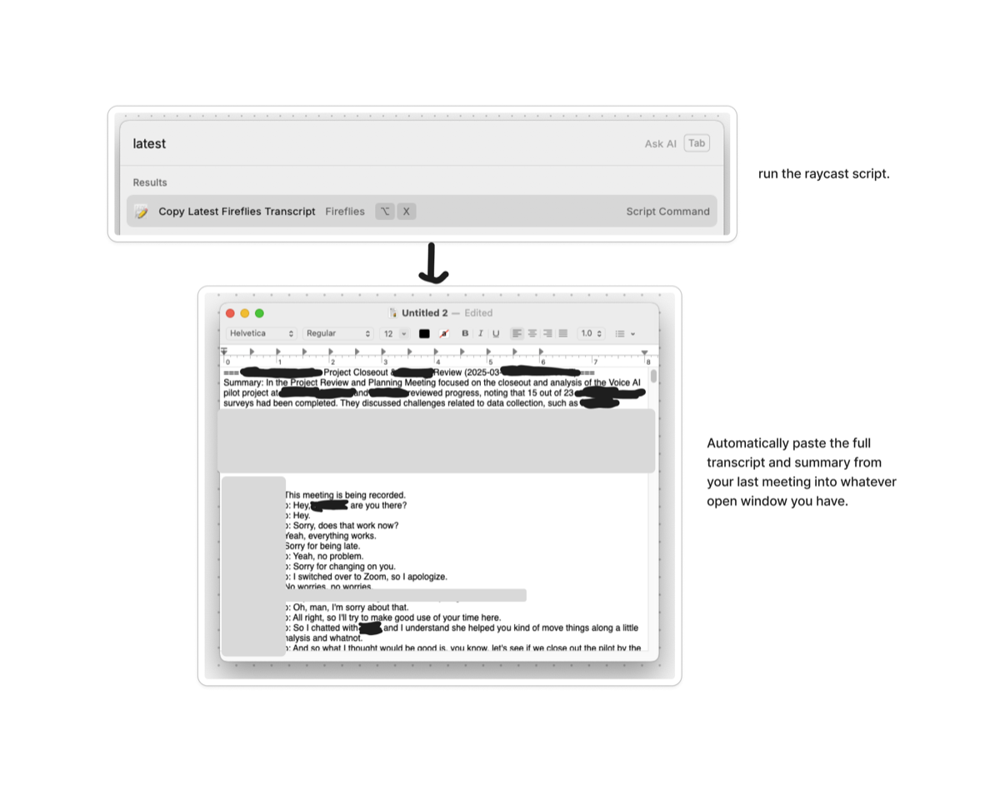

# FlyCast

<div align="center">

[](LICENSE)
[](https://github.com/culstrup/fireflies-raycast/stargazers)
[](https://codecov.io/gh/culstrup/fireflies-raycast)
[](https://ko-fi.com/culstrup)

</div>

Access your [Fireflies.ai](https://fireflies.ai) meeting transcripts directly from [Raycast](https://raycast.com)! This script collection allows you to:

1. **Copy your latest transcript** to your clipboard with a single command
2. **Fetch transcripts from open Chrome tabs** and copy them to your clipboard
3. **Generate AI-powered case studies** from all meetings with a specific client domain

Perfect for quickly referencing meeting notes, creating client success stories, and leveraging your meeting data with AI.

## 🤔 Why FlyCast?

Context is king when working with AI. Meeting transcripts contain some of the most valuable context for your work, but they're often trapped in siloed systems, making it hard to leverage this data.

FlyCast solves this problem by making it effortless to:

- Extract transcript data from Fireflies (one of the few providers with an accessible API)
- Instantly use meeting transcripts with powerful AI tools like Claude, ChatGPT, and others
- Dramatically reduce friction when providing meeting context to AI systems

**Common Use Cases:**
- Provide user feedback from meetings to improve products
- Draft comprehensive follow-up emails after important discussions
- Get AI coaching and feedback on sales calls or negotiations
- Turn complex discussions into bespoke proposals
- Combine transcripts from multiple meetings on the same project for complete context
- **Generate professional case studies when closing out client projects**
- **Create client success stories for marketing and testimonials**
- **Produce project retrospectives for internal learning**

## 📸 Screenshots

**Copy Latest Transcript:**


**Fetch All Transcripts from Chrome Tabs:**


## 🚀 Quick Setup

1. Download or clone this repository
2. Run the setup script:
   ```bash
   ./setup.sh
   ```
3. Enter your Fireflies API key when prompted (or add it to the `.env` file later)
4. **(For Case Studies)** Add your Google AI Studio API key to the `.env` file:
   ```
   GOOGLE_AI_STUDIO_KEY="your-google-ai-key-here"
   ```
   Get your key at [Google AI Studio](https://aistudio.google.com/app/apikey)
5. Add the script directory to Raycast

## 📋 How to Get Your Fireflies API Key

1. Log in to your Fireflies.ai account
2. Go to [Settings](https://app.fireflies.ai/settings)
3. Click on "Developer Settings"
4. Scroll down to the API key section
5. Generate a new API key
6. Copy the key and paste it when prompted during setup (or add to `.env` file)

> ⚠️ **IMPORTANT**: Keep your API key secure! Never share it publicly or commit it to a repository. The `.env` file is included in `.gitignore` to prevent accidentally committing your key.

## 🧩 Available Commands

Once installed, you'll have access to these commands in Raycast:

- **Fetch Fireflies Transcripts from Chrome**: Copies transcripts from open Chrome tabs
- **Copy Latest Fireflies Transcript**: Copies your most recent Fireflies transcript
- **Generate Case Study from Domain**: Creates AI-powered case studies from meetings with specific client domains

## 🔧 Manual Setup (if not using setup.sh)

1. Clone or download this repository
2. Create a Python virtual environment:
   ```bash
   python -m venv .venv
   source .venv/bin/activate
   pip install -r requirements.txt
   ```
3. Create a `.env` file with your API keys:
   ```
   FIREFLIES_API_KEY="your-fireflies-api-key-here"
   GOOGLE_AI_STUDIO_KEY="your-google-ai-key-here"  # For case study generation
   ```
4. Make the scripts executable:
   ```bash
   chmod +x *.py *.sh
   ```

## 📱 Raycast Integration

To add these scripts to Raycast:

1. Open Raycast
2. Go to Extensions > Script Commands
3. Click "Add Script Directory"
4. Select this directory

## 🔒 Enabling Paste Functionality

To enable automatic pasting:

1. Open System Preferences > Security & Privacy > Privacy > Accessibility
2. Add Raycast to the list of apps allowed to control your computer

## 💡 How It Works

- The scripts use the Fireflies GraphQL API to fetch your transcripts
- A shared `FirefliesAPI` class handles all API interactions and error handling
- For Chrome tab fetching, it uses AppleScript to get URLs from Chrome tabs
- Transcripts are fetched in parallel for significantly faster performance
- Results are always combined in the original tab order regardless of API response time
- Transcripts are formatted and copied to your clipboard
- If accessibility permissions are granted, it can automatically paste content
- Built with robust error handling for API issues, missing transcripts, and processing meetings

### 🤖 AI Case Study Generator

**Transform your client meetings into professional case studies with one command!**

Perfect for when you're closing out a project and need to quickly create a shareable success story. The case study generator uses Google's Gemini AI to analyze all meetings with a specific client and produce a compelling narrative.

#### Key Features

- **Domain-based filtering**: Automatically finds all meetings with participants from your client's email domain
- **Flexible time ranges**: Look back 10, 30, 60, 90, 180 days or more to capture the full project lifecycle
- **AI-powered analysis**: Uses Gemini 2.5 Pro to identify key themes, challenges, solutions, and outcomes
- **Chronological narrative**: Orders meetings by date to show project progression and evolution
- **Professional output**: Creates publication-ready case studies with:
  - Executive Summary
  - Client Background & Challenges
  - Solution Journey
  - Implementation Process
  - Results & Impact
  - Client Testimonials (extracted from actual meeting quotes)
  - Key Takeaways

#### How to Use

1. **Run the command** in Raycast: "Generate Case Study from Domain"
2. **Enter the client domain** (e.g., "acme.com")
3. **Specify days to look back** (optional, default: 180 days)
   - Recent project? Try 30 or 60 days
   - Long engagement? Use 90 or 180 days
4. **Wait ~20-30 seconds** while FlyCast:
   - Searches through your meetings
   - Filters for the client domain
   - Analyzes the transcripts with AI
   - Generates the case study
5. **Case study is copied to clipboard** - paste into Google Docs, Notion, etc.
6. **Review and refine** before sharing with your client for approval

#### Example Workflow

```bash
# Just closed a 3-month project with Acme Corp?
Raycast: Generate Case Study from Domain
Domain: acme.com
Days back: 90

# Result: Professional case study ready to share!
```

#### Sample Output Preview

```markdown
# Acme Corp: Transforming Customer Engagement Through Strategic Innovation

## Executive Summary
Over a 3-month engagement, we partnered with Acme Corp to revolutionize their
customer engagement strategy, resulting in a 40% increase in user satisfaction...

## Client Background
Acme Corp, a leading provider of enterprise software solutions...

## The Challenge
"We were struggling to understand why our user engagement was declining,"
explained Sarah Johnson, VP of Product at Acme Corp during our initial meeting...
```

## 📝 Requirements

- macOS (for AppleScript functionality)
- Python 3.6+
- Raycast
- Google Chrome
- Fireflies.ai account with API access

## 🔍 Troubleshooting

### General Issues
- Check the debug log at `debug.log` in the script directory
- Ensure your API keys are correct in the `.env` file
- Verify that you've granted accessibility permissions to Raycast

### Case Study Generation Issues

**"No meetings found with participants from @domain"**
- Verify the domain is correct (e.g., "company.com" not "www.company.com")
- Check if participants use different email domains (subsidiaries, personal emails)
- Try increasing the days back parameter

**"GOOGLE_AI_STUDIO_KEY not found"**
- Add your Google AI Studio API key to the `.env` file
- Get a free key at [Google AI Studio](https://aistudio.google.com/app/apikey)

**Case study is too short or missing content**
- Ensure you have substantial meeting content with the client
- Try a longer time range to capture more meetings
- Check that meetings have transcript content (not just titles)

**Generation takes too long**
- Normal generation time is 20-40 seconds
- Searching through many meetings (>100) may take longer
- Consider using a more specific date range

## 🧪 Testing

FlyCast includes unit tests to ensure everything works as expected:

```bash
# Run all tests
./run_tests.sh
```

## 🛠️ Development

### Setting up pre-commit hooks

FlyCast uses pre-commit hooks to ensure code quality. To set them up:

```bash
# Install development dependencies
pip install -r requirements.txt

# Install pre-commit hooks
make setup-hooks

# Or manually:
pre-commit install
```

The hooks will automatically run on every commit to:
- Fix code style issues with Ruff
- Check for common problems
- Ensure consistent formatting

To run the hooks manually:
```bash
make pre-commit
```

## 🛡️ Security

FlyCast takes security seriously, especially regarding your Fireflies API key:

- API keys are stored only in your local `.env` file
- The `.env` file is excluded from git via `.gitignore`
- Never share your API key or commit it to a repository

For more details, see our [Security Policy](SECURITY.md).

## ❤️ Support This Project

If you find FlyCast useful, consider supporting its development:

- [Buy me a coffee on Ko-fi](https://ko-fi.com/culstrup)
- Star the repository on GitHub
- Share with other Fireflies users
- Contribute improvements via pull requests

Your support helps maintain and improve this tool!

### 📊 Case Study Best Practices

1. **Timing is Everything**: Generate case studies while the project is fresh - within a week of completion
2. **Domain Accuracy**: Use the exact email domain your client uses (check meeting participants)
3. **Review Before Sharing**: AI-generated content should be reviewed and refined
4. **Client Approval**: Always get written approval before publishing or sharing publicly
5. **Sensitive Information**: Review for any confidential data before sharing
6. **Multiple Stakeholders**: If meetings include multiple client domains, focus on the primary one

## 📄 License

This project is licensed under the MIT License by GSD at Work LLC - see the [LICENSE](LICENSE) file for details.

Feel free to use, modify, and distribute this code however you want - all we ask is that you share how it helps you!
